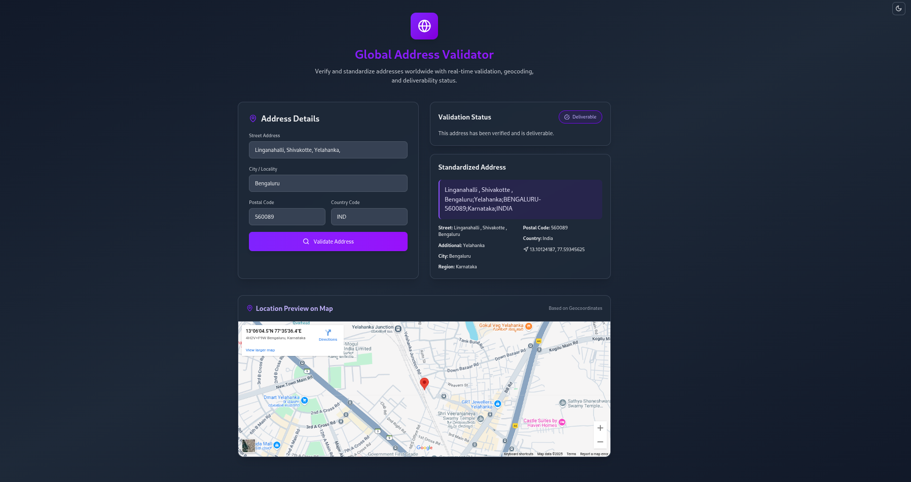

# VeriLoc 🌍

**VeriLoc** is a modern, responsive web application designed to **verify, standardize, and geolocate addresses globally** using the [Melissa Global Address API](https://rapidapi.com/melissadata/api/global-address) and [Google Maps Embed API](https://developers.google.com/maps/documentation/embed/overview). Built with **Next.js 14 App Router**, **Tailwind CSS**, **TypeScript**, and **Geist fonts**, it delivers real-time address validation with a sleek, accessible UI and dark mode support.

---

## ✨ Features

- 🌐 **Global Address Validation**: Verify addresses across 240+ countries.
- 📍 **Geolocation**: Preview locations with an interactive Google Maps embed.
- 📦 **Standardized Output**: Get properly formatted addresses, including postal codes.
- 🌓 **Dark Mode**: Supports system preference or manual toggle for light/dark themes.
- ⚡ **Responsive & Fast**: Optimized UI with smooth loading states.
- 💅 **Accessible Design**: Styled with Tailwind CSS for a polished, mobile-friendly experience.
- 📱 **Performant**: Lightweight and optimized for all devices.

---

## 🚀 Demo

🔗 **Live Demo**: [https://veriloc.vercel.app/](https://veriloc.vercel.app/) *(Update with your deployed URL)*



---

## 🧰 Tech Stack

- **[Next.js 14](https://nextjs.org/)**: React framework for server-side rendering and routing.
- **[React](https://reactjs.org/)**: Component-based UI library.
- **[Tailwind CSS](https://tailwindcss.com/)**: Utility-first CSS framework for styling.
- **[TypeScript](https://www.typescriptlang.org/)**: Type-safe JavaScript for robust code.
- **[Melissa Global Address API](https://rapidapi.com/melissadata/api/global-address)**: For address validation and standardization.
- **[Google Maps Embed API](https://developers.google.com/maps/documentation/embed/overview)**: For geolocation visualization.
- **[Geist Fonts](https://vercel.com/font)**: Modern typography for a clean look.

---

## 🛠️ Getting Started

### Prerequisites
- **Node.js**: Version 18 or higher.
- **Melissa API Key**: Obtain from [RapidAPI](https://rapidapi.com/melissadata/api/global-address).
- **Google Maps API Key**: Optional for map embeds (get from [Google Cloud](https://developers.google.com/maps)).

### 1. Clone the Repository

```bash
git clone https://github.com/AmruthLP12/VeriLoc.git
cd veriloc
```

### 2. Install Dependencies

```bash
npm install
```

### 3. Set Up Environment Variables

Create a `.env.local` file in the root directory and add your API key:

```env
RAPIDAPI_KEY=your_rapidapi_key
```

> **⚠️ Important**: Keep your API keys secure. Never commit `.env.local` to version control. Add it to `.gitignore`.

### 4. Run in Development

```bash
npm run dev
```

Open [http://localhost:3000](http://localhost:3000) to view the app.

### 5. Build for Production

```bash
npm run build
```

Deploy the app using [Vercel](#deploy-to-vercel) or your preferred hosting platform.

---

## 🧱 Folder Structure

```
veriloc/
├── /app              # Next.js App Router pages
├── /components       # Reusable React components (e.g., mode toggle, layout)
├── /lib              # API logic and helper functions
├── /public           # Static assets (favicon, veriloc-preview.png)
├── .env.local        # Environment variables (not tracked)
├── .gitignore        # Git ignore file
├── package.json      # Dependencies and scripts
└── README.md         # Project documentation
```

---

## 🚀 Deploy to Vercel

Deploy VeriLoc to Vercel with one click:

[](https://vercel.com/new/clone?repository-url=https://github.com/AmruthLP12/veriloc)

1. Connect your GitHub repository.
2. Add `MELISSA_API_KEY` and `GOOGLE_MAPS_API_KEY` as environment variables in Vercel.
3. Deploy and get a live URL.

---

## 🧑‍💻 Author

**Amruth L P**

- **GitHub**: [AmruthLP12](https://github.com/AmruthLP12)
- **Portfolio**: [amrthlp.vercel.app](https://amrthlp.vercel.app) 

---

## 📌 Notes


- Default address is set to a valid location in Karnataka, India.
- A future version with [Nominatim (OpenStreetMap)](https://nominatim.org/) is planned for rural address support.

---

## ⭐ Support

If you like VeriLoc, give it a ⭐ on [GitHub](https://github.com/AmruthLP12/veriloc) or support me via:

- [Buy Me a Coffee](https://www.ko-fi.com/codewithamruth)
- [PayPal](https://paypal.me/amruthlp) 

---

## 📄 License

This project is licensed under the **MIT License**. See the [LICENSE](#mit-license) file for details.

---

## ✅ To Do

- [x] Add `veriloc-preview.png` to `/public/` for the README screenshot.
- [ ] Add rural address support using Nominatim.
- [ ] Enhance error handling for invalid API keys.
- [ ] Add unit tests for API and UI components.

---

## MIT License


